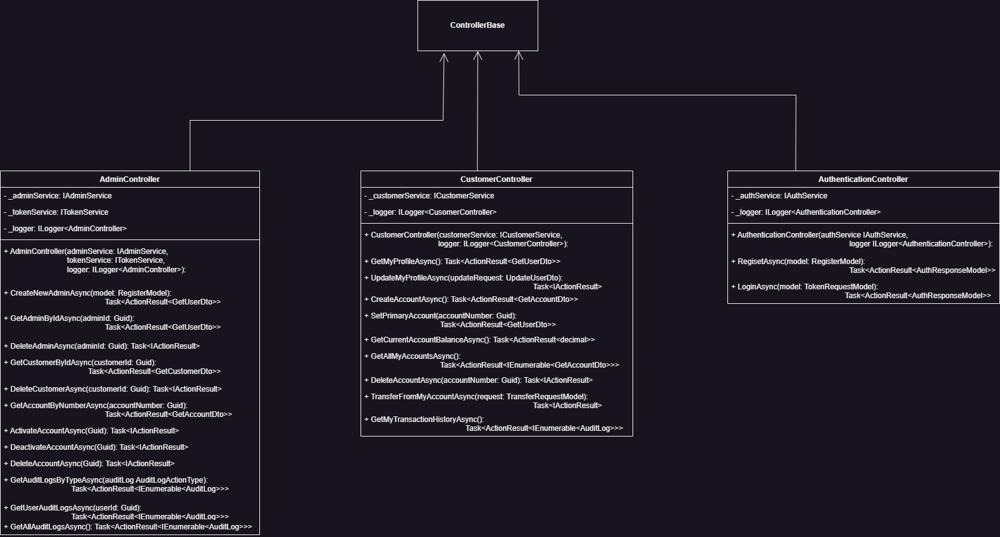
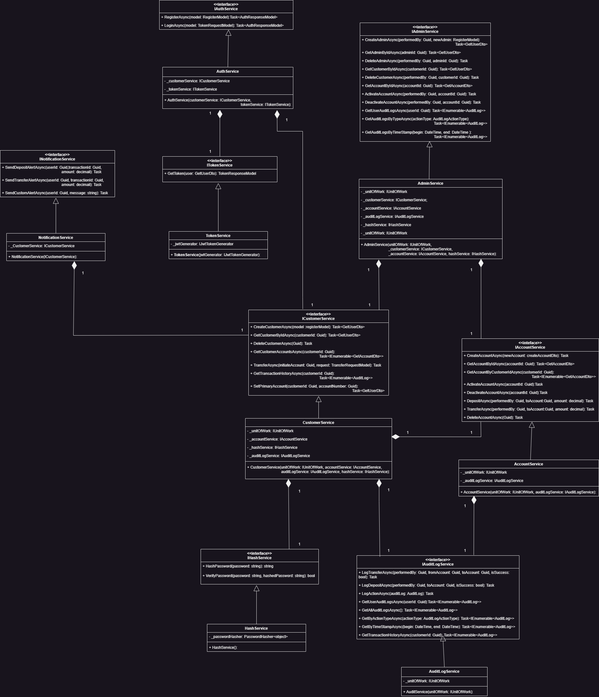
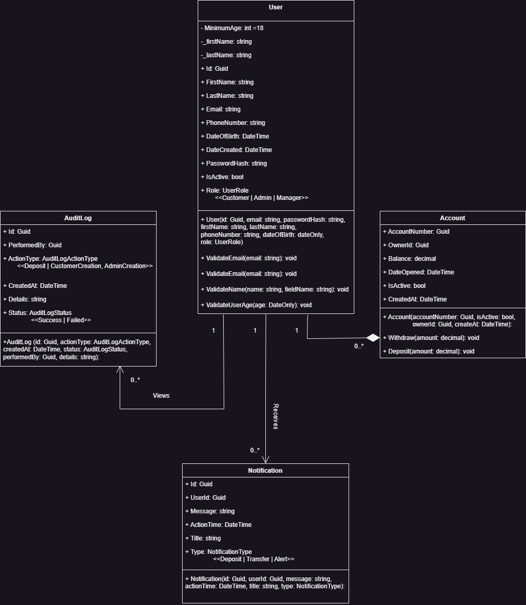
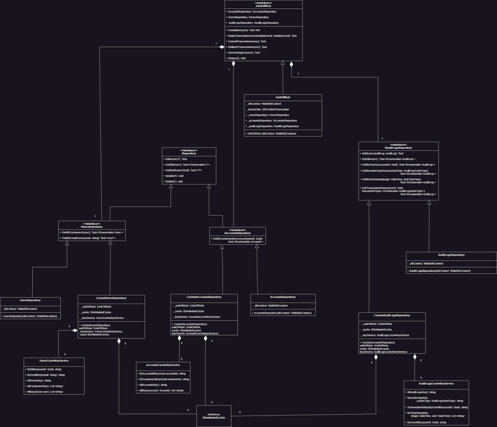
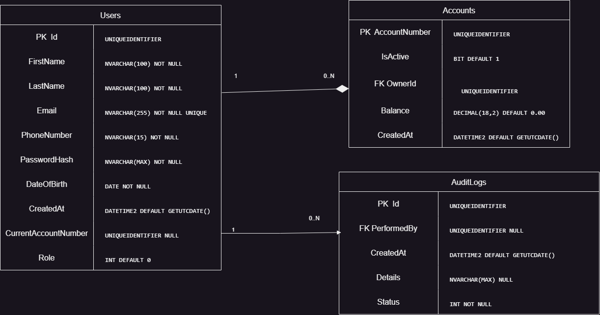
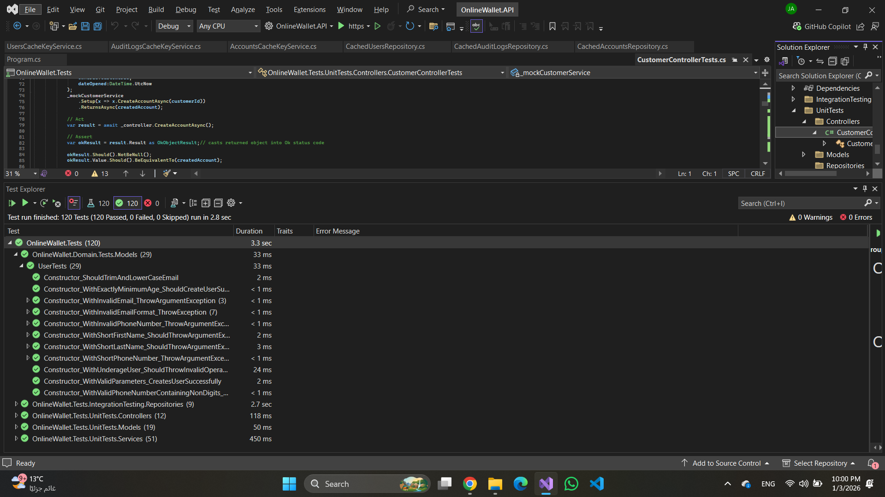

# 🏦 OnlineWallet - Enterprise Financial Management System

A production-ready, enterprise-grade online wallet management system built with **ASP.NET Core 8.0**. This project demonstrates advanced software engineering practices including **Clean Architecture**, **Domain-Driven Design (DDD)**, **Repository & Unit of Work patterns**, **Redis caching with Decorator Pattern**, **comprehensive security measures**, **transactional integrity**, and **containerized deployment** for financial operations.

[](https://dotnet.microsoft.com/)
[](https://docs.microsoft.com/en-us/dotnet/csharp/)
[](https://www.microsoft.com/sql-server)
[](https://redis.io/)
[](https://www.docker.com/)
[](https://docs.microsoft.com/ef/core/)
[](https://jwt.io/)
[](https://xunit.net/)
[](https://github.com/moq/moq4)
[](https://fluentassertions.com/)
[](https://swagger.io/)


## 🚀 Quick Start (Docker)

```bash
# 1. Clone and run in 60 seconds
git clone https://github.com/AhmedMostafa79/OnlineWallet.git
cd OnlineWallet

# 2. Start everything with one command
docker-compose up -d

# 3. Access the application
# Swagger UI: http://localhost:8080/swagger
# API: http://localhost:8080
# Health: http://localhost:8080/health

```

### Default Manager Account

The application automatically seeds a **Manager account** on first run for system administration:

**Credentials:**
- **Email**: `manager@gmail.com`
- **Password**: `Manager@279`
- **Role**: Manager

⚠️ **Important**: Change this password immediately in production environments for security.

**Manager Capabilities:**
- Create and delete Admin accounts
- Full administrative access to all system features
- Manage all users and accounts
- View complete audit logs


## 📋 Table of Contents

- [Project Highlights](#-project-highlights)
- [Skills Demonstrated](#-skills-demonstrated)
- [Technical Architecture](#-technical-architecture)
- [Class Diagrams](#-class-diagrams)
- [Core Features](#-core-features)
- [Technology Stack](#-technology-stack)
- [Design Patterns & Principles](#-design-patterns--principles)
- [Project Structure](#-project-structure)
- [Security Implementation](#-security-implementation)
- [Performance Optimization](#-performance-optimization)
- [API Documentation](#-api-documentation)
- [Database Design](#-database-design)
- [Testing Strategy](#-testing-strategy)
- [Docker & Containerization](#-docker--containerization)
- [Getting Started](#-getting-started)
- [Configuration](#-configuration)
- [Performance Metrics](#performance-metrics)
- [Future Enhancements](#future-enhancements)

- [Acknowledgments](#acknowledgments)

- [Author & Contact](#author--contact)
---

## 🎯 Project Highlights

This project showcases expertise in:

- ✅ **Clean Architecture** - Clear separation of concerns with distinct layers (API, Application, Domain, Infrastructure)
- ✅ **Domain-Driven Design** - Rich domain models with encapsulated business logic and validation
- ✅ **Repository Pattern with Unit of Work** - Coordinated data access with transaction management
- ✅ **Decorator Pattern for Caching** - Redis-based distributed caching layer with graceful fallback
- ✅ **Strategy Pattern** - JWT token generation strategies with extensible design
- ✅ **Transaction Management** - ACID compliance with Serializable isolation levels for critical operations
- ✅ **Comprehensive Audit Logging** - Complete audit trail for all financial operations and administrative actions
- ✅ **Role-Based Access Control** - Three-tier authorization (Customer, Admin, Manager)
- ✅ **Advanced Security** - JWT authentication, BCrypt password hashing, and endpoint rate limiting
- ✅ **Docker Containerization** - Multi-container architecture with Docker Compose orchestration
- ✅ **Production-Ready** - Health checks, structured logging, error handling, and Swagger documentation

---

## 💼 Technical Achievments

**Through building this enterprise financial system, I've demonstrated practical experience with:**


### Backend Development
- ASP.NET Core 8, C# 12, Entity Framework Core, SQL Server
- REST API design, DTOs, middleware, dependency injection

### Software Architecture  
- Clean Architecture, Domain-Driven Design, SOLID principles
- Repository & Unit of Work patterns, CQRS principles

### Security & Performance
- JWT authentication, BCrypt hashing, role-based authorization
- Redis caching (Decorator Pattern), rate limiting, audit logging

### Quality Assurance
- 92 test cases (xUnit, Moq, FluentAssertions), 100% passing
- Integration testing, transaction testing, edge case validation

### DevOps & Deployment
- Docker containerization, Docker Compose orchestration
- Multi-service architecture, health checks, configuration management

---
## 🏗️ Technical Architecture

### Clean Architecture Layers

```
┌─────────────────────────────────────────────────────────────┐
│                      API Layer                              │
│  • Controllers (Authentication, Customer, Admin)            │
│  • Middleware & Filters                                     │
│  • Swagger/OpenAPI Documentation                            │
│  • JWT Authentication Configuration                         │
│  • Rate Limiting Policies                                   │
├─────────────────────────────────────────────────────────────┤
│                  Application Layer                          │
│  • Service Implementations (Auth, Account, Customer, Admin) │
│  • DTOs (CreateAccountDto, GetUserDto, etc.)               │
│  • Business Logic & Validation                              │
│  • Custom Validation Attributes (StrongPassword)           │
│  • Token Service with Strategy Pattern                      │
├─────────────────────────────────────────────────────────────┤
│                     Domain Layer                            │
│  • Entities (User, Account, AuditLog, Notification)        │
│  • Enums (UserRole, AuditLogActionType, NotificationType)  │
│  • Business Rules & Domain Validation                       │
│  • Value Objects & Domain Logic                             │
├─────────────────────────────────────────────────────────────┤
│                 Infrastructure Layer                        │
│  • EF Core DbContext (WalletDbContext)                     │
│  • Repository Implementations                               │
│  • Cached Repository Decorators (Redis)                    │
│  • Unit of Work with Transaction Management                 │
│  • Database Migrations                                      │
│  • Cache Key Services                                       │
└─────────────────────────────────────────────────────────────┘
```

### Key Architectural Decisions

1. **Dependency Injection** - All components are loosely coupled through interfaces
2. **Database Transaction Management** - Critical operations use `Serializable` isolation level to prevent race conditions
3. **Caching Strategy** - Decorator Pattern wraps repositories with Redis caching while maintaining fallback to database
4. **Exception Handling** - Custom `ExceptionHelper` distinguishes business vs. system exceptions
5. **Audit Logging** - Every critical operation is logged regardless of success or failure using `finally` blocks

---

## 📊 Class Diagrams & Database Schemas

This project includes comprehensive **UML class diagrams** created with Draw.io for each architectural layer, providing visual documentation of the system's structure, relationships, and dependencies.

### 1. API Layer Diagram

The API layer diagram shows controllers, endpoints, authentication flow, and dependency injection configuration.



**Key Components:**
- Controller classes and their actions (AuthenticationController, CustomerController, AdminController)
- HTTP endpoints and route mappings
- Request/response models
- JWT authentication middleware flow
- Service dependency injection

---

### 2. Application Layer Diagram

The application layer diagram illustrates business logic services, DTOs, and validation.



**Key Components:**
- Service interfaces and implementations (AuthService, AccountService, CustomerService, AdminService)
- DTOs (Data Transfer Objects)
- Business logic flow and validation
- Token generation strategies
- Helper classes and utilities

---

### 3. Domain Layer Diagram

The domain layer diagram depicts entities, relationships, enums, and business rules.



**Key Components:**
- Entity classes (User, Account, AuditLog, Notification)
- Domain enums (UserRole, AuditLogActionType, NotificationType, AuditLogStatus)
- Entity relationships and cardinality (1:*, 1:1)
- Business rules and validation logic
- Domain-driven design principles

---

### 4. Infrastructure Layer Diagram

The infrastructure layer diagram shows data access patterns, caching decorators, and repository implementations.



**Key Components:**
- Repository interfaces and implementations
- Cached repository decorators (Redis integration)
- DbContext configuration and migrations
- Unit of Work pattern with transaction management
- Cache key services for distributed caching

---

### 5. Database Logical Schema

The logical schema diagram illustrates the database structure with entities, attributes, data types, and relationships.


**Key Components:**
- Entity tables (Users, Accounts, AuditLogs)
- Primary and foreign key relationships
- Column definitions with data types and constraints
- Entity relationships and cardinality
- Database-level constraints and indexes

---

### 6. Database Physical Schema

The physical schema diagram shows the actual database implementation details including indexes, constraints, and storage specifications.



**Key Components:**
- Physical table structures with SQL Server-specific types
- Foreign key constraints and referential integrity rules
- Index definitions for performance optimization
- Constraint implementations (CHECK, UNIQUE, NOT NULL)
- Database storage and performance considerations

---

## ✨ Core Features

### 🔐 Authentication & Authorization

- **User Registration** - Secure user registration with domain validation (minimum age 18, email format, strong password)
- **JWT Authentication** - Stateless authentication using JSON Web Tokens with configurable expiration
- **Role-Based Authorization** - Three distinct roles:
  - **Customer** - Standard users with account and transaction capabilities
  - **Admin** - System administrators with user management capabilities
  - **Manager** - Super administrators who can manage other admins
- **Password Security** - BCrypt hashing with automatic validation against strong password policy

### 💰 Account Management

- **Multi-Account Support** - Users can create and manage multiple wallet accounts
- **Account Lifecycle** - Activate/deactivate accounts with business rule enforcement
- **Balance Tracking** - Real-time balance updates with domain-level validation (no negative balances)
- **Account Deletion** - Safe deletion with business rules (only zero-balance accounts can be deleted)
- **Current Account Management** - Customers can designate which account is their primary/current account for quick access and default operations

### 💸 Financial Transactions

- **Fund Transfers** - Peer-to-peer transfers between accounts with atomic operations
- **Deposits** - Add funds to accounts with validation and audit trails
- **Transaction Safety** - Serializable isolation level prevents race conditions and double-spending
- **Automatic Rollback** - Failed transactions automatically rollback with detailed error logging
- **Transaction History** - Complete audit log of all financial operations per user

### 👥 User Management (Admin Functions)

- **Customer Management** - Admins can view, search, and manage customer accounts
- **Admin Creation** - Managers can create new administrator accounts
- **User Deletion** - Safe user deletion with business rule enforcement (must have no active accounts)
- **Profile Management** - Users can update their personal information
- **Comprehensive Audit Trail** - All administrative actions are logged with performer, timestamp, and status

### 📊 Audit & Compliance

- **Comprehensive Audit Logging** - Every sensitive operation is tracked:
  - User registrations and deletions
  - Account creations and deletions
  - All financial transactions (deposits, transfers)
  - ALL administrative actions
- **Transaction History** - Users can view their complete transaction history
- **Success/Failure Tracking** - Audit logs capture both successful and failed operations
- **Detailed Context** - Each log includes performer ID, timestamp, action type, status, and descriptive details

### 🔒 Security Features

- **Rate Limiting** - Endpoint-specific rate limits using AspNetCoreRateLimit:
  - Login attempts: 5 per minute (prevents brute force)
  - Transfer operations: 10 per hour (prevents abuse)
  - General endpoints: 100 per minute
- **Input Validation** - Domain-level and application-level validation
- **SQL Injection Prevention** - Parameterized queries via Entity Framework Core
- **Strong Password Policy** - Minimum 8 characters with uppercase, lowercase, digit, and special character
- **JWT Token Security** - HMAC-SHA256 signing with configurable expiration

### ⚡ Performance Features

- **Redis Distributed Caching** - Decorator Pattern implementation:
  - User data caching by ID and email
  - Account data caching by account number and customer ID
  - Audit log caching
  - Automatic cache invalidation on updates
  - Graceful fallback to database if Redis is unavailable
- **Asynchronous Operations** - All I/O operations are fully asynchronous
- **Optimized Database Queries** - Efficient EF Core queries with proper indexing strategies
- **Connection Pooling** - Built-in EF Core connection pooling
- **Health Checks** - `/health` endpoint for monitoring application status

---

## 🛠️ Technology Stack

### Backend Framework
- **ASP.NET Core 8.0** - Latest .NET framework with minimal APIs and performance improvements
- **C# 12.0** - Modern C# features including record types, pattern matching, and null-safety

### Data Access
- **Entity Framework Core 8.0** - ORM with LINQ query support and migrations
- **SQL Server** - Relational database management system
- **Redis (StackExchange.Redis)** - Distributed caching with pub/sub capabilities

### Security & Authentication
- **JWT Bearer Authentication** - Token-based stateless authentication
- **BCrypt.NET** - Industry-standard password hashing
- **AspNetCoreRateLimit** - Middleware for IP and endpoint-based rate limiting

### API Documentation
- **Swashbuckle (Swagger/OpenAPI)** - Interactive API documentation with XML comments
- **XML Documentation** - Comprehensive inline documentation for all public APIs

### Testing
- **xUnit** - Unit testing framework with [Fact] and [Theory] attributes
- **Moq** - Mocking framework for creating test doubles and isolating dependencies
- **FluentAssertions** - Expressive assertion library for readable test code
- **Integration Tests** - Full stack testing with test database

### DevOps & Monitoring
- **Health Checks** - ASP.NET Core health check middleware
- **Structured Logging** - ILogger integration with multiple sink support

---

## 🎨 Design Patterns & Principles

### Implemented Design Patterns

#### 1. **Repository Pattern**
```csharp
public interface IUsersRepository
{
    Task AddAsync(User user);
    Task<User?> GetByIdAsync(Guid id);
    Task<User?> FindByEmailAsync(string email);
    Task<IEnumerable<User>> GetAllAsync();
    // ... more methods
}
```

#### 2. **Unit of Work Pattern**
- Coordinates multiple repositories
- Uses lazy initialization
- Manages database transactions
- Ensures data consistency across operations
```csharp
public interface IUnitOfWork
{
    IAccountsRepository AccountsRepository { get; }
    IUsersRepository UsersRepository { get; }
    IAuditLogsRepository AuditLogsRepository { get; }
    Task BeginTransactionAsync(IsolationLevel isolationLevel);
    Task CommitTransactionAsync();
    Task RollbackTransactionAsync();
    Task SaveChangesAsync();
}
```

#### 3. **Decorator Pattern** (Caching Implementation)
- Wraps repository implementations with caching logic
- Transparent to consumers
- Graceful fallback to database on cache failures
```csharp
public class CachedUsersRepository : IUsersRepository
{
    private readonly IUsersRepository _decoratedRepo;
    private readonly IDistributedCache _cache;
    private readonly UsersCacheKeyService _keyService;
    
    // Caching logic wrapped around repository operations
    public async Task<User?> GetByIdAsync(Guid id)
    {
        var cacheKey = _keyService.ByIdKey(id);
        var cachedUser = await _cache.GetStringAsync(cacheKey);
        
        if (cachedUser != null)
            return JsonSerializer.Deserialize<User>(cachedUser);
            
        var user = await _decoratedRepo.GetByIdAsync(id);
        
        if (user != null)
            await _cache.SetStringAsync(cacheKey, 
                JsonSerializer.Serialize(user), _cacheOptions);
                
        return user;
    }
}
```

#### 4. **Strategy Pattern** (Token Generation)
```csharp
public interface IJwtTokenGenerator
{
    JwtSecurityToken GenerateToken(GetUserDto user);
    TokenResponseModel GetToken(GetUserDto user);
}
```

#### 5. **Factory Pattern**
- Used in dependency injection configuration
- Service registration with multiple implementations

### SOLID Principles

- **Single Responsibility** - Each class has one clear responsibility (e.g., `AccountService` for account operations)
- **Open/Closed** - Extensible through interfaces (e.g., `ITokenService` can have multiple strategies)
- **Liskov Substitution** - Decorators can replace decorated repositories transparently
- **Interface Segregation** - Focused interfaces (e.g., separate `ICustomerService` and `IAdminService`)
- **Dependency Inversion** - All dependencies through abstractions (interfaces)

### Domain-Driven Design Concepts

- **Entities** - `User`, `Account`, `AuditLog` with unique identities
- **Value Objects** - Encapsulated validation logic
- **Aggregate Roots** - `User` and `Account` as aggregate roots
- **Domain Events** - Audit logging captures domain events
- **Ubiquitous Language** - Consistent terminology across layers

---

## 📁 Project Structure

```
OnlineWallet/
│
├── src/
│   ├── OnlineWallet.API/                      # Web API Layer
│   │   ├── Controllers/
│   │   ├── AuthenticationController.cs        # Registration & Login (AllowAnonymous)
│   │   ├── CustomerController.cs              # Customer operations (Authorize: Customer)
│   │   └── AdminController.cs                 # Admin operations (Authorize: Admin, Manager)
│   ├── Properties/
│   │   └── launchSettings.json                # Development launch configuration
│   ├── appsettings.json                       # Production configuration
│   ├── appsettings.Development.json           # Development configuration
│   ├── Program.cs                             # Application entry point & DI configuration
│   └── OnlineWallet.API.http                   # HTTP request samples for testing
│
├── OnlineWallet.Application/                  # Application Layer
│   ├── DTOs/
│   │   ├── CreateAccountDto.cs                # Account creation data transfer object
│   │   ├── GetAccountDto.cs                   # Account retrieval DTO
│   │   ├── GetUserDto.cs                      # User retrieval DTO
│   │   └── UpdateUserDto.cs                   # User update DTO
│   ├── Helpers/
│   │   ├── ExceptionHelper.cs                 # Business vs. system exception classification
│   │   └── JWT.cs                             # JWT configuration model
│   ├── Interfaces/
│   │   ├── IAccountService.cs                 # Account business logic interface
│   │   ├── IAdminService.cs                   # Admin operations interface
│   │   ├── IAuditLogService.cs                # Audit logging interface
│   │   ├── IAuthService.cs                    # Authentication interface
│   │   ├── ICustomerService.cs                # Customer operations interface
│   │   ├── IHashService.cs                    # Password hashing interface
│   │   ├── INotificationService.cs            # Notification service interface
│   │   ├── ITokenService.cs                   # Token management interface
│   │   └── TokenStrategies/
│   │       └── IJwtTokenGenerator.cs          # JWT token generation strategy
│   ├── Models/
│   │   ├── AuthResponseModel.cs               # Authentication response model
│   │   ├── RegisterModel.cs                   # User registration request model
│   │   ├── TokenRequestModel.cs               # Login request model
│   │   ├── TokenResponseModel.cs              # Token response model
│   │   └── TransferRequestModel.cs            # Fund transfer request model
│   ├── Services/
│   │   ├── AccountService.cs                  # Account business logic implementation
│   │   ├── AdminService.cs                    # Admin operations implementation
│   │   ├── AuditLogService.cs                 # Audit logging implementation
│   │   ├── AuthService.cs                     # Authentication implementation
│   │   ├── CustomerService.cs                 # Customer operations implementation
│   │   ├── HashService.cs                     # BCrypt password hashing
│   │   ├── NotificationService.cs             # Notification service (future: email/SMS)
│   │   ├── TokenService.cs                    # Token management service
│   │   └── TokenStrategies/
│   │       └── JwtTokenGenerator.cs           # JWT generation strategy implementation
│   └── Validation/
│       └── StrongPasswordAttribute.cs         # Custom password validation attribute
│
├── OnlineWallet.Domain/                       # Domain Layer
│   ├── Enums/
│   │   ├── AuditLogActionType.cs              # Types of audited actions (Deposit, Transfer, etc.)
│   │   ├── AuditLogStatus.cs                  # Audit log status (Success, Failed)
│   │   ├── NotificationType.cs                # Notification types (Deposit, Transfer, Alert)
│   │   └── UserRole.cs                        # User roles (Customer, Admin, Manager)
│   │   └── Models/
│   │       ├── Account.cs                     # Account aggregate root with business logic
│   │       ├── AuditLog.cs                    # Audit log entity
│   │       ├── Notification.cs                # Notification entity
│   │       └── User.cs                        # User aggregate root with validation
│   │
│   ├── OnlineWallet.Infrastructure/           # Infrastructure Layer
│   │   ├── Caching/
│   │   ├── Decorators/
│   │   │   ├── CachedUsersRepository.cs       # User repository caching decorator
│   │   │   ├── CachedAccountsRepository.cs    # Account repository caching decorator
│   │   │   └── CachedAuditLogsRepository.cs   # Audit log repository caching decorator
│   │   └── Services/
│   │       ├── UsersCacheKeyService.cs        # Cache key generation for users
│   │       ├── AccountsCacheKeyService.cs     # Cache key generation for accounts
│   │       └── AuditLogsCacheKeyService.cs    # Cache key generation for audit logs
│   ├── Interfaces/
│   │   ├── IUsersRepository.cs                # User repository interface
│   │   ├── IAccountsRepository.cs             # Account repository interface
│   │   ├── IAuditLogsRepository.cs            # Audit log repository interface
│   │   └── IUnitOfWork.cs                     # Unit of work interface
│   ├── Repositories/
│   │   ├── UsersRepository.cs                 # User data access implementation
│   │   ├── AccountsRepository.cs              # Account data access implementation
│   │   ├── AuditLogsRepository.cs             # Audit log data access implementation
│   │   └── UnitOfWork.cs                      # Unit of work implementation
│   │   ├── Migrations/                        # EF Core database migrations
│   │   ├── WalletDbContext.cs                 # Entity Framework DbContext
│   │   └── WalletDbContextFactory.cs          # Design-time DbContext factory
│   │
│   └── OnlineWallet.Tests/                    # Test Project
│       ├── UnitTests/
│       │   ├── Controllers/                   # Controller unit tests
│       │   ├── Models/                        # Model validation tests
│       │   ├── Repositories/                  # Repository tests
│       │   └── Services/                      # Service layer tests
│       └── IntegrationTesting/
│           └── Repositories/                  # Database integration tests
│
├── docs/
│   └── Diagrams/                              # UML Class Diagrams & Database ERDs
│       ├── OnlineWallet.API.drawio.png        # API layer architecture diagram
│       ├── OnlineWallet.Application.drawio.png # Application layer services & DTOs
│       ├── OnlineWallet.Domain.drawio.png     # Domain entities & relationships
│       ├── OnlineWallet.Infrastructure.drawio.png # Infrastructure repositories & caching
│       ├── OnlineWallet.Tests.png             # Test architecture
│       ├── database-logical-erd.png           # Database logical schema
│       └── database-physical-erd.png          # Database physical schema
│
├── docker-compose.yml                         # Docker orchestration
├── Dockerfile                                 # Docker build instructions
├── .dockerignore                              # Docker build exclusions
└── README.md                                  # This file
```

---

## 🔐 Security Implementation

### 1. Authentication Flow

```
User → POST /api/authentication/register
     ↓
[Validation] → Email format, Strong password, Age ≥ 18
     ↓
[BCrypt Hash] → Password hashing (work factor: 12)
     ↓
[Database] → User created with Customer role
     ↓
[JWT Generation] → Token with user claims
     ↓
Response: { token, expiresAt, tokenType: "Bearer", user details }
```

### 2. Authorization Hierarchy

```
┌─────────────────────────────────────────────────┐
│                   Manager                       │
│  • Create/Delete Admins                         │
│  • All Admin capabilities                       │
├─────────────────────────────────────────────────┤
│                    Admin                        │
│  • View/Manage all customers                    │
│  • View/Manage all accounts                     │
│  • Activate/Deactivate accounts                 │
│  • Delete customers (with business rules)       │
│  • View audit logs                              │
├─────────────────────────────────────────────────┤
│                  Customer                       │
│  • Create/Delete own accounts                   │
│  • View account balances                        │
│  • Transfer funds                               │
│  • View transaction history                     │
│  • Update own profile                           │
└─────────────────────────────────────────────────┘
```

### 3. Password Security

**Strong Password Requirements** (enforced via `StrongPasswordAttribute`):
- Minimum 8 characters
- At least one uppercase letter
- At least one lowercase letter
- At least one digit
- At least one special character

**Hashing**: BCrypt with automatic salt generation

### 4. JWT Token Configuration

```json
{
  "JWT": {
    "Key": "Base64-encoded-secret-key-minimum-32-bytes",
    "Issuer": "OnlineWaallet",
    "Audience": "OnlineWalletUser",
    "DurationInMinutes": 15
  }
}
```

**Token Claims**:
- `sub`: User ID
- `NameIdentifier`: User ID (for authorization)
- `jti`: Unique token ID
- `email`: User email
- `role`: User role (Customer/Admin/Manager)
- `name`: User's full name

### 5. Rate Limiting Configuration

```json
{
  "IpRateLimiting": {
    "EnableEndpointRateLimiting": true,
    "GeneralRules": [
      {
        "Endpoint": "POST:/api/Authentication/login",
        "Period": "1m",
        "Limit": 5
      },
      {
        "Endpoint": "POST:/api/Customer/transfer",
        "Period": "1h",
        "Limit": 10
      },
      {
        "Endpoint": "*",
        "Period": "1m",
        "Limit": 100
      }
    ]
  }
}
```

---

## ⚡ Performance Optimization

### 1. Caching Strategy (Decorator Pattern)

**Cache Hierarchy**:
```
Request → Controller → Service → Repository Decorator
                                       ↓
                                  Check Cache
                                       ↓
                                 Cache Hit? → Return cached data
                                       ↓ No
                                  Database Query
                                       ↓
                                  Store in Cache
                                       ↓
                                  Return data
```

**Cache Configuration**:
- **Sliding Expiration**: 10 minutes (extends on access)
- **Absolute Expiration**: 1 hour (maximum cache lifetime)
- **Graceful Degradation**: Falls back to database if Redis is unavailable

**Cached Operations**:
- User lookups by ID and email
- Account lookups by account number and customer ID
- Audit log retrievals

**Cache Invalidation**:
- Automatic invalidation on Add/Update/Delete operations
- List cache cleared on any modification
- Individual entity cache updated or removed

### 2. Database Optimizations

**Transaction Isolation Levels**:
- **Serializable** - Used for financial transactions (transfers, deposits) to prevent race conditions
- **Read Committed** - Default level for read operations

**Asynchronous Operations**:
- All database queries use `async/await` pattern
- Non-blocking I/O operations throughout the stack

### 3. Redis Configuration

```json
{
  "ConnectionStrings": {
    "Redis": "localhost:6379,abortConnect=false"
  }
}
```

`abortConnect=false` ensures graceful fallback if Redis is temporarily unavailable.

---

## 📚 API Documentation

### Authentication Endpoints

#### Register New User
```http
POST /api/authentication/register
Content-Type: application/json

{
  "email": "john.doe@example.com",
  "password": "SecurePass123!",
  "firstName": "John",
  "lastName": "Doe",
  "phoneNumber": "12345678901",
  "dateOfBirth": "1995-01-15"
}

Response: 200 OK
{
  "token": "eyJhbGciOiJIUzI1NiIsInR5cCI6IkpXVCJ9...",
  "expiresAt": "2025-12-30T15:30:00Z",
  "tokenType": "Bearer",
  "id": "3fa85f64-5717-4562-b3fc-2c963f66afa6",
  "email": "john.doe@example.com",
  "firstName": "John",
  "lastName": "Doe",
  "role": "Customer"
}
```

#### Login
```http
POST /api/authentication/login
Content-Type: application/json

{
  "email": "john.doe@example.com",
  "password": "SecurePass123!"
}

Response: 200 OK
{
  "token": "eyJhbGciOiJIUzI1NiIsInR5cCI6IkpXVCJ9...",
  "expiresAt": "2025-12-30T15:30:00Z",
  "tokenType": "Bearer",
  "id": "3fa85f64-5717-4562-b3fc-2c963f66afa6",
  "email": "john.doe@example.com",
  "firstName": "John",
  "lastName": "Doe",
  "role": "Customer"
}
```

### Customer Endpoints (Requires: Role = Customer)

#### Get Profile
```http
GET /api/customer/profile
Authorization: Bearer {token}

Response: 200 OK
{
  "id": "3fa85f64-5717-4562-b3fc-2c963f66afa6",
  "firstName": "John",
  "lastName": "Doe",
  "email": "john.doe@example.com",
  "phoneNumber": "12345678901",
  "dateOfBirth": "1995-01-15",
  "role": "Customer"
}
```

#### Create New Account
```http
POST /api/customer/accounts
Authorization: Bearer {token}

Response: 200 OK
{
  "accountNumber": "7c9e6679-7425-40de-944b-e07fc1f90ae7",
  "isActive": true,
  "ownerId": "3fa85f64-5717-4562-b3fc-2c963f66afa6",
  "balance": 0.00,
  "dateOpened": "2025-12-30T10:00:00Z"
}
```

#### Get Current Account
```http
GET /api/customer/accounts/current
Authorization: Bearer {token}

Response: 200 OK
{
  "accountNumber": "7c9e6679-7425-40de-944b-e07fc1f90ae7",
  "isActive": true,
  "ownerId": "3fa85f64-5717-4562-b3fc-2c963f66afa6",
  "balance": 1500.50,
  "dateOpened": "2025-12-30T10:00:00Z"
}
```

#### Get Current Account Balance
```http
GET /api/customer/accounts/current/balance
Authorization: Bearer {token}

Response: 200 OK
1500.50
```

#### Get All My Accounts
```http
GET /api/customer/accounts
Authorization: Bearer {token}

Response: 200 OK
[
  {
    "accountNumber": "7c9e6679-7425-40de-944b-e07fc1f90ae7",
    "isActive": true,
    "ownerId": "3fa85f64-5717-4562-b3fc-2c963f66afa6",
    "balance": 1500.50,
    "dateOpened": "2025-12-30T10:00:00Z"
  }
]
```

#### Transfer Funds
```http
POST /api/customer/accounts/current/transfers
Authorization: Bearer {token}
Content-Type: application/json

{
  "toAccount": "8d7f5690-8536-51ef-c4ed-3d183e2a1bf8",
  "amount": 250.00
}

Response: 200 OK
{
  "message": "Successfully transferred 250.00 to 8d7f5690-8536-51ef-c4ed-3d183e2a1bf8",
  "amount": 250.00,
  "toAccount": "8d7f5690-8536-51ef-c4ed-3d183e2a1bf8"
}
```

#### Get Transaction History
```http
GET /api/customer/transactions
Authorization: Bearer {token}

Response: 200 OK
[
  {
    "id": "9e8d6752-9647-62fg-d5fe-4e294f3b2cg9",
    "performedBy": "3fa85f64-5717-4562-b3fc-2c963f66afa6",
    "actionType": "Transfer",
    "createdAt": "2025-12-30T14:25:00Z",
    "details": "Transferred 250.00 from account 7c9e6679... to account 8d7f5690...",
    "status": "Success"
  }
]
```

#### Delete Account
```http
DELETE /api/customer/accounts/{accountNumber}
Authorization: Bearer {token}

Response: 200 OK
{
  "message": "Account is successfully deleted",
  "accountNumber": "7c9e6679-7425-40de-944b-e07fc1f90ae7"
}
```

### Admin Endpoints (Requires: Role = Admin or Manager)

#### Get All Customers
```http
GET /api/admin/customers
Authorization: Bearer {token}

Response: 200 OK
[
  {
    "id": "3fa85f64-5717-4562-b3fc-2c963f66afa6",
    "firstName": "John",
    "lastName": "Doe",
    "email": "john.doe@example.com",
    "role": "Customer"
  }
]
```

#### Get Customer by ID
```http
GET /api/admin/customer/{customerId}
Authorization: Bearer {token}

Response: 200 OK
{
  "id": "3fa85f64-5717-4562-b3fc-2c963f66afa6",
  "firstName": "John",
  "lastName": "Doe",
  "email": "john.doe@example.com",
  "phoneNumber": "12345678901",
  "role": "Customer"
}
```

#### Delete Customer
```http
DELETE /api/admin/customer/{customerId}
Authorization: Bearer {token}

Response: 200 OK
{
  "message": "Customer with ID 3fa85f64-5717-4562-b3fc-2c963f66afa6 is deleted successfully"
}
```

#### Get All Accounts
```http
GET /api/admin/accounts
Authorization: Bearer {token}

Response: 200 OK
[
  {
    "accountNumber": "7c9e6679-7425-40de-944b-e07fc1f90ae7",
    "isActive": true,
    "ownerId": "3fa85f64-5717-4562-b3fc-2c963f66afa6",
    "balance": 1500.50,
    "dateOpened": "2025-12-30T10:00:00Z"
  }
]
```

#### Activate Account
```http
POST /api/admin/account/{accountNumber}/activate
Authorization: Bearer {token}

Response: 200 OK
{
  "message": "Account 7c9e6679-7425-40de-944b-e07fc1f90ae7 is successfully activated"
}
```

#### Deactivate Account
```http
POST /api/admin/account/{accountNumber}/deactivate
Authorization: Bearer {token}

Response: 200 OK
{
  "message": "Account 7c9e6679-7425-40de-944b-e07fc1f90ae7 is successfully deactivated"
}
```

### Manager Endpoints (Requires: Role = Manager)

#### Create New Admin
```http
POST /api/admin/admins
Authorization: Bearer {token}
Content-Type: application/json

{
  "email": "admin@example.com",
  "password": "AdminPass123!",
  "firstName": "Jane",
  "lastName": "Smith",
  "phoneNumber": "12345678902",
  "dateOfBirth": "1990-05-20"
}

Response: 201 Created
{
  "id": "4gb96f75-6828-5673-c4gd-3d074g77bgb7",
  "firstName": "Jane",
  "lastName": "Smith",
  "email": "admin@example.com",
  "role": "Admin"
}
```

#### Delete Admin
```http
DELETE /api/admin/admin/{adminId}
Authorization: Bearer {token}

Response: 200 OK
{
  "message": "Admin with ID 4gb96f75-6828-5673-c4gd-3d074g77bgb7 is deleted successfully"
}
```

### Swagger Documentation

Interactive API documentation available at: `https://localhost:7071/swagger`

---

## 💾 Database Design

This section provides comprehensive database documentation including entity relationships, table structures, and visual schema diagrams.

💡 **Visual Schemas**: See detailed [Database Logical Schema](docs/Diagrams/database-logical-erd.png) and [Database Physical Schema](docs/Diagrams/database-physical-erd.png) diagrams in the [Class Diagrams](#-class-diagrams) section.

### Entity Relationship Diagram

```
                           ┌─────────────────────┐
                           │       User          │
                           ├─────────────────────┤
                           │ Id (PK)             │
                           │ FirstName           │
                           │ LastName            │
                           │ Email (Unique)      │
                           │ PhoneNumber         │
                           │ PasswordHash        │
                           │ DateOfBirth         │
                           │ Role                │
                           │ CurrentAccountNumber│
                           │ CreatedAt           │
                           └──────┬──────────────┘
                                  │
                                  │
                ┌─────────────────┴─────────────────┐
                │                                   │
         0..1 ◇│                             0..1  │
                │ *                                 │ *
                │                                   │
       ┌────────▼────────┐                   ┌──────▼──────┐
       │   Account       │                   │  AuditLog   │
       ├─────────────────┤                   ├─────────────┤
       │ AccountNumber(PK)│                   │ Id (PK)     │
       │ IsActive        │                   │ PerformedBy │
       │ OwnerId (FK)    │                   │    (FK)     │
       │ Balance         │                   │ ActionType  │
       │ CreatedAt       │                   │ CreatedAt   │
       └─────────────────┘                   │ Details     │
                                             │ Status      │
                                             └─────────────┘
```

**Relationships:**
- **User ◇→ Account** (1:N Aggregation) - User has multiple accounts; accounts belong to a user
- **User → AuditLog** (1:N Association) - User has multiple audit log entries (PerformedBy FK)

### Database Tables

#### Users Table
| Column | Type | Constraints | Description |
|--------|------|------------|-------------|
| Id | UNIQUEIDENTIFIER | PRIMARY KEY | User unique identifier |
| FirstName | NVARCHAR(100) | NOT NULL | User's first name (validated, trimmed) |
| LastName | NVARCHAR(100) | NOT NULL | User's last name (validated, trimmed) |
| Email | NVARCHAR(255) | NOT NULL, UNIQUE | Email address (Gmail-style regex validated) |
| PhoneNumber | NVARCHAR(15) | NOT NULL | Phone number (exactly 11 digits) |
| PasswordHash | NVARCHAR(MAX) | NOT NULL | BCrypt hashed password |
| DateOfBirth | DATE | NOT NULL | Birth date (min age 18 enforced) |
| Role | INT | NOT NULL | UserRole enum (0=Customer, 1=Admin, 2=Manager) |
| CurrentAccountNumber | UNIQUEIDENTIFIER | NULL | Reference to current active account |
| CreatedAt | DATETIME2 | NOT NULL | UTC timestamp of user creation |

#### Accounts Table
| Column | Type | Constraints | Description |
|--------|------|------------|-------------|
| AccountNumber | UNIQUEIDENTIFIER | PRIMARY KEY | Account unique identifier |
| IsActive | BIT | NOT NULL | Account active status |
| OwnerId | UNIQUEIDENTIFIER | NOT NULL, FOREIGN KEY | Reference to Users.Id |
| Balance | DECIMAL(18,2) | NOT NULL, CHECK >= 0 | Current account balance (cannot be negative) |
| CreatedAt | DATETIME2 | NOT NULL | UTC timestamp of account creation |

#### AuditLogs Table
| Column | Type | Constraints | Description |
|--------|------|------------|-------------|
| Id | UNIQUEIDENTIFIER | PRIMARY KEY | Audit log entry unique identifier |
| PerformedBy | UNIQUEIDENTIFIER | NULL | User who performed the action (null for anonymous) |
| ActionType | INT | NOT NULL | AuditLogActionType enum |
| CreatedAt | DATETIME2 | NOT NULL | UTC timestamp of action |
| Details | NVARCHAR(MAX) | NULL | Detailed description of the action |
| Status | INT | NOT NULL | AuditLogStatus enum (0=Success, 1=Failed) |

### Key Business Rules (Enforced at Domain Level)

1. **User Registration**:
   - Email must be unique and valid format
   - Minimum age of 18 years
   - Password must meet strong password criteria
   - Phone number must be exactly 11 digits

2. **Account Operations**:
   - Balance cannot be negative (enforced via domain validation)
   - Only zero-balance accounts can be deleted
   - Account must be active for deposits and transfers

3. **Transfers**:
   - Cannot transfer to the same account
   - Both accounts must be active
   - Transfer amount must be positive
   - Source account must have sufficient funds

---

## 🧪 Testing Strategy

### ✅ Visual Proof: All 92 Tests Passing


### Test Coverage Overview

The project includes **92 comprehensive test cases** across multiple layers, ensuring robust code quality and reliability. Tests are organized using **xUnit** framework with **Moq** for mocking and **FluentAssertions** for readable assertions.

```
OnlineWallet.Tests/
├── UnitTests/                                    (83 test cases)
│   ├── Controllers/           # 13 test cases - Controller action tests with mocked dependencies
│   ├── Models/                # 17 test cases - Domain model validation tests
│   │   ├── UserTests.cs       # 11 test cases (Fact & Theory)
│   │   ├── AccountTests.cs    # 7 test cases (Fact & Theory)
│   │   ├── AuditLogTests.cs   # 1 test case
│   │   └── NotificationTests.cs # 1 test case
│   └── Services/              # 53 test cases - Service layer business logic tests
│       ├── CustomerServiceTests.cs  # 27 test cases
│       ├── AccountServiceTests.cs   # 20 test cases
│       └── AuthServiceTests.cs      # 6 test cases
│
└── IntegrationTesting/                           (9 test cases)
    └── Repositories/          # 9 test cases - Database integration tests
        └── UsersRepositoryTests.cs
```

### Unit Testing Framework & Tools

- **xUnit** - Primary testing framework with [Fact] and [Theory] attributes
- **Moq** - Mocking framework for creating test doubles of dependencies
- **FluentAssertions** - Provides natural language assertions for better test readability
- **Test Isolation** - Each test is completely independent with no shared state

### Testing Methodologies

#### **xUnit Attributes Used:**

1. **[Fact]** - Single test case with no parameters (75 tests)
   ```csharp
   [Fact]
   public async Task CreateAccount_WithValidData_ShouldSucceed()
   {
       // Arrange, Act, Assert
   }
   ```

2. **[Theory]** with **[InlineData]** - Parameterized tests for multiple scenarios (17 tests)
   ```csharp
   [Theory]
   [InlineData("")]
   [InlineData(null)]
   [InlineData("   ")]
   public void Constructor_WithInvalidEmail_ThrowsException(string invalidEmail)
   {
       // Test with multiple invalid inputs
   }
   ```

#### **Test Structure (AAA Pattern):**

All tests follow the **Arrange-Act-Assert** pattern:
- **Arrange**: Set up test data and mock dependencies
- **Act**: Execute the method under test
- **Assert**: Verify expected outcomes using FluentAssertions

#### **Mocking Strategy:**

```csharp
// Example from CustomerServiceTests
private readonly Mock<IUnitOfWork> _mockUnitOfWork;
private readonly Mock<IHashService> _mockHashService;
private readonly Mock<IAccountService> _mockAccountService;
private readonly Mock<IAuditLogService> _mockAuditLogService;

// Dependencies are mocked to isolate unit under test
_mockUnitOfWork.Setup(x => x.UsersRepository.GetByIdAsync(userId))
    .ReturnsAsync(testUser);
```

### Test Execution & Continuous Testing

**Run all tests:**
```bash
dotnet test
```

**Run specific test class:**
```bash
dotnet test --filter "FullyQualifiedName~CustomerServiceTests"
```

**Run tests with detailed output:**
```bash
dotnet test --logger "console;verbosity=detailed"
```

**Generate code coverage report:**
```bash
dotnet test /p:CollectCoverage=true /p:CoverageReporter=html
```

### Key Testing Principles Applied

1. **Comprehensive Coverage**: Tests cover happy paths, edge cases, and error scenarios
2. **Test Isolation**: No dependencies between tests; each test can run independently
3. **Fast Execution**: Unit tests execute in milliseconds using mocks instead of real dependencies
4. **Readable Assertions**: FluentAssertions provide natural language-like test assertions
5. **Business Rule Validation**: Every domain rule is validated with dedicated tests
6. **Error Handling**: Negative test cases ensure proper exception handling
7. **Transaction Testing**: Integration tests verify database transaction integrity

### Areas of Focus

- ✅ **Domain Validation**: All business rules enforced at the domain level are tested
- ✅ **Service Logic**: Complex business operations (transfers, deposits) are thoroughly tested
- ✅ **Authentication & Authorization**: JWT token generation and validation tested
- ✅ **Data Access**: Repository patterns tested with real database interactions
- ✅ **API Contracts**: Controller actions tested for correct HTTP responses
- ✅ **Edge Cases**: Boundary conditions and error scenarios covered
- ✅ **Concurrency**: Transaction isolation and rollback mechanisms tested

### Test Quality Metrics

| Metric | Value | Description |
|--------|-------|-------------|
| **Total Test Cases** | 92 | Comprehensive coverage across all layers |
| **Unit Tests** | 83 (90.2%) | Fast, isolated tests with mocked dependencies |
| **Integration Tests** | 9 (9.8%) | Real database interaction tests |
| **Theory Tests** | 17 (18.5%) | Parameterized tests for multiple scenarios |
| **Fact Tests** | 75 (81.5%) | Single-scenario validation tests |
| **Average Execution Time** | <2s | All tests run in under 2 seconds |
| **Test Success Rate** | 100% | All tests pass consistently |

---

## 🐳 Docker & Containerization

The application is **fully containerized** using Docker and Docker Compose for consistent deployment across any environment.

### Architecture

The system runs as **three interconnected containers**:
- **SQL Server 2022** - Database for all application data
- **Redis 7** - High-performance caching layer
- **ASP.NET Core 8.0 API** - Main application (multi-stage build for optimized image size)

All services communicate through a dedicated Docker network with automatic health checks and data persistence using Docker volumes.

## 🚀 Getting Started

### Quick Start with Docker (Recommended)

**Prerequisites:** [Docker Desktop](https://www.docker.com/products/docker-desktop)

1. **Clone the repository**:
   ```bash
   git clone https://github.com/AhmedMostafa79/OnlineWallet.git
   cd OnlineWallet
   ```

2. **Create `.env` file** in the root directory:
   ```env
   SA_PASSWORD=YourStrong@Password123
   DB_NAME=OnlineWalletDb
   # Generate with: openssl rand -base64 32
   # Or PowerShell: [Convert]::ToBase64String((1..32 |% {[byte](Get-Random -Maximum 256)}))
   JWT_KEY=REPLACE_WITH_YOUR_OWN_SECURE_KEY
   JWT_ISSUER=OnlineWaallet
   JWT_AUDIENCE=OnlineWalletUser
   JWT_DURATION=15
   ASPNETCORE_ENVIRONMENT=Production
   ```

3. **Start the application**:
   ```bash
   docker-compose up -d
   ```

4. **Access the application**:
   - **Swagger UI**: `http://localhost:8080/swagger`
   - **API**: `http://localhost:8080`
   - **Health Check**: `http://localhost:8080/health`

That's it! The application, database, and cache are now running.

---

### Alternative: Manual Setup (Without Docker)

### Prerequisites

- **.NET 8.0 SDK** or later - [Download](https://dotnet.microsoft.com/download/dotnet/8.0)
- **SQL Server** (LocalDB, Express, or Full) - [Download](https://www.microsoft.com/sql-server/sql-server-downloads)
- **Redis** (Optional for caching) - [Download](https://redis.io/download)
- **Visual Studio 2022** or **VS Code** - [Download](https://visualstudio.microsoft.com/)

### Installation Steps

#### 1. Clone the Repository
```bash
git clone https://github.com/AhmedMostafa79/OnlineWallet.git
cd OnlineWallet
```

#### 2. Configure Database Connection

Edit `OnlineWallet.API/appsettings.json`:

```json
{
  "ConnectionStrings": {
    "DefaultConnection": "Server=(localdb)\\mssqllocaldb;Database=OnlineWalletDb;Trusted_Connection=True;TrustServerCertificate=True",
    "Redis": "localhost:6379,abortConnect=false"
  }
}
```

**Connection String Options**:
- **LocalDB**: `Server=(localdb)\\mssqllocaldb;Database=OnlineWalletDb;Trusted_Connection=True;TrustServerCertificate=True`
- **SQL Server Express**: `Server=localhost\\SQLEXPRESS;Database=OnlineWalletDb;Trusted_Connection=True;TrustServerCertificate=True`
- **Full SQL Server**: `Server=localhost;Database=OnlineWalletDb;Trusted_Connection=True;TrustServerCertificate=True`

#### 3. Apply Database Migrations

**Option A: Using .NET CLI**
```bash
cd OnlineWallet.Infrastructure
dotnet ef database update --startup-project ../OnlineWallet.API
```

**Option B: Using Package Manager Console in Visual Studio**
```powershell
# Set OnlineWallet.API as startup project
# Open Package Manager Console (Tools > NuGet Package Manager > Package Manager Console)
# Set Default Project to OnlineWallet.Infrastructure
Update-Database
```

#### 4. Configure JWT Secret Key

Generate a secure key (minimum 32 bytes, Base64 encoded):

```powershell
# PowerShell command to generate random key
$bytes = New-Object Byte[] 32
[Security.Cryptography.RandomNumberGenerator]::Create().GetBytes($bytes)
[Convert]::ToBase64String($bytes)
```

Update `appsettings.json`:
```json
{
  "JWT": {
    "Key": "YOUR-GENERATED-KEY-HERE",
    "Issuer": "OnlineWaallet",
    "Audience": "OnlineWalletUser",
    "DurationInMinutes": 15
  }
}
```

#### 5. (Optional) Set Up Redis

**Using Docker**:
```bash
docker run -d -p 6379:6379 --name redis redis:latest
```

**Using Windows**: Download and install from [Redis for Windows](https://github.com/microsoftarchive/redis/releases)

**Without Redis**: The application will work without Redis by falling back to database queries.

#### 6. Build the Solution

```bash
dotnet build
```

#### 7. Run the Application

```bash
cd OnlineWallet.API
dotnet run
```

The API will be available at:
- **HTTPS**: `https://localhost:7071`
- **HTTP**: `http://localhost:5095`
- **Swagger UI**: `https://localhost:7071/swagger`
- **Health Check**: `https://localhost:7071/health`

#### 8. Test the API

**Option A: Using Swagger UI**
1. Navigate to `https://localhost:7071/swagger`
2. Expand endpoints and click "Try it out"
3. Fill in request body and click "Execute"

**Option B: Using the Provided HTTP File**
1. Open `OnlineWallet.API.http` in Visual Studio or VS Code
2. Click "Send Request" above each endpoint

**Option C: Using PowerShell/Curl**
```powershell
# Register a new user
Invoke-RestMethod -Uri "https://localhost:7071/api/authentication/register" `
  -Method POST `
  -ContentType "application/json" `
  -Body '{"email":"test@example.com","password":"Test123!","firstName":"Test","lastName":"User","phoneNumber":"12345678901","dateOfBirth":"1995-01-01"}'
```

---

## ⚙️ Configuration

### appsettings.json Structure

```json
{
  "Logging": {
    "LogLevel": {
      "Default": "Information",
      "Microsoft.AspNetCore": "Warning"
    }
  },
  "AllowedHosts": "*",
  "ConnectionStrings": {
    "DefaultConnection": "Server=localhost;Database=OnlineWalletDb;Trusted_Connection=True;TrustServerCertificate=True",
    "Redis": "localhost:6379,abortConnect=false"
  },
  "JWT": {
    "Key": "WttSWXygrEQLAdUGOoS6yw0hRSU98/z2ETGZIMi4bL0=",
    "Issuer": "OnlineWaallet",
    "Audience": "OnlineWalletUser",
    "DurationInMinutes": 15
  },
  "IpRateLimiting": {
    "EnableEndpointRateLimiting": true,
    "GeneralRules": [
      {
        "Endpoint": "POST:/api/Authentication/login",
        "Period": "1m",
        "Limit": 5
      },
      {
        "Endpoint": "POST:/api/Customer/transfer",
        "Period": "1h",
        "Limit": 10
      },
      {
        "Endpoint": "*",
        "Period": "1m",
        "Limit": 100
      }
    ]
  }
}
```

### Configuration Sections Explained

#### JWT Settings
- **Key**: Base64-encoded secret key (minimum 256 bits / 32 bytes)
- **Issuer**: Token issuer identifier
- **Audience**: Token audience identifier
- **DurationInMinutes**: Token expiration time (default: 15 minutes)

#### Rate Limiting
- **EnableEndpointRateLimiting**: Enable/disable rate limiting per endpoint
- **GeneralRules**: Array of rate limit rules
  - **Endpoint**: API endpoint path (use `*` for all)
  - **Period**: Time period (1s, 1m, 1h, 1d)
  - **Limit**: Maximum requests allowed in the period

#### Redis Configuration
- **abortConnect=false**: Continues operation if Redis is unavailable
- Caching will gracefully fall back to database queries

---

## 📈 Performance Metrics

Based on local development testing:

| Metric | Value | Notes |
|--------|-------|-------|
| **Average Response Time** | <50ms | Cached read operations |
| **Database Query Time** | <20ms | EF Core optimized queries |
| **Transfer Transaction Time** | ~100ms | Includes Serializable isolation |
| **Concurrent Users Supported** | 100+ | Limited by rate limiting config |
| **Cache Hit Rate** | >80% | For frequently accessed data |
| **Redis Fallback Time** | <5ms | Seamless database fallback |

---

## 🔮 Future Enhancements

### Planned Features

- [ ] **Email/SMS Notifications** - Complete notification service implementation
- [ ] **Two-Factor Authentication (2FA)** - Enhanced security with TOTP
- [ ] **CI/CD Pipeline** - GitHub Actions for automated testing and deployment
- [ ] **Admin Dashboard** - Web-based admin panel with analytics
- [ ] **API Versioning** - Support for multiple API versions

---

## 👨‍💻 Author & Contact

**Ahmed Mustafa** - Self-Taught .NET Backend Developer


*This enterprise-grade financial system was built through self-directed learning using DeepSeek and YouTube resources, demonstrating the ability to independently master complex software engineering concepts.*


- **GitHub**: [github.com/AhmedMostafa79](https://github.com/AhmedMostafa79)
- **LinkedIn**: [linkedin.com/in/ahmed-mostafa-profile](https://www.linkedin.com/in/ahmed-khater-332121259?)
- **Email**: ahmedkhater7779@gmail.com

---

## 📄 License

This project is licensed under the MIT License.

---

## 🙏 Acknowledgments

- ASP.NET Core Team for the excellent framework
- Entity Framework Core Team for the powerful ORM
- Redis Team for the high-performance cache
- Open-source community for various libraries and tools

---

### Code Standards
- Follow C# coding conventions
- Add XML documentation comments to public APIs
- Write unit tests for new features
- Ensure all tests pass before submitting PR
- Keep commits atomic and well-described

---

**⭐ If you find this project useful or impressive, please consider giving it a star!**

---

*This project demonstrates advanced ASP.NET Core development skills, clean architecture principles, and production-ready practices suitable for enterprise applications.*
